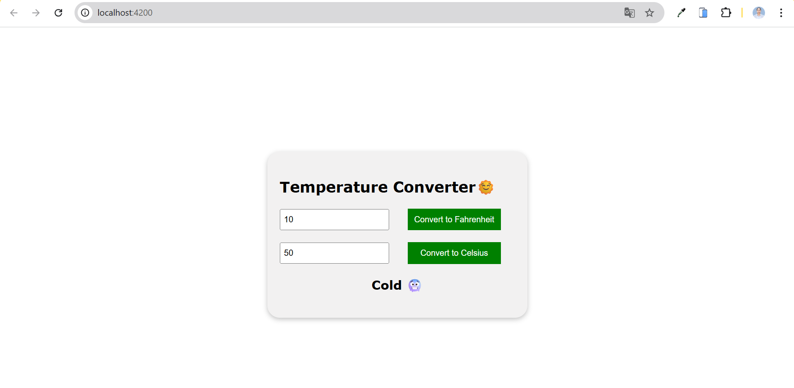

# 🌡️ Temperature Converter 🌞

A simple Angular app that lets users convert temperature values between **Celsius** and **Fahrenheit** and displays emoji-based weather descriptions like "Hot 🔥☀️", "Cool 🌬️", or "Freezing 🧊".

---

## 📸 Features

- ✅ Convert Celsius to Fahrenheit
- ✅ Convert Fahrenheit to Celsius
- ✅ Real-time conversion using `ngModel`
- ✅ Emoji feedback based on the temperature
- ✅ Built with Angular standalone components

---

## 🚀 Built With

- Angular 17+
- TypeScript
- HTML, CSS
- FormsModule & CommonModule

---

### Project SnapShots

### 1️⃣ Clone the Repository

```bash
git clone https://github.com/VaishnaviDhobale/convert-temp.git
cd convert-temp
